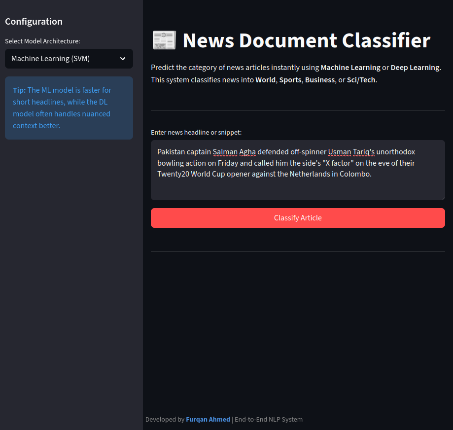
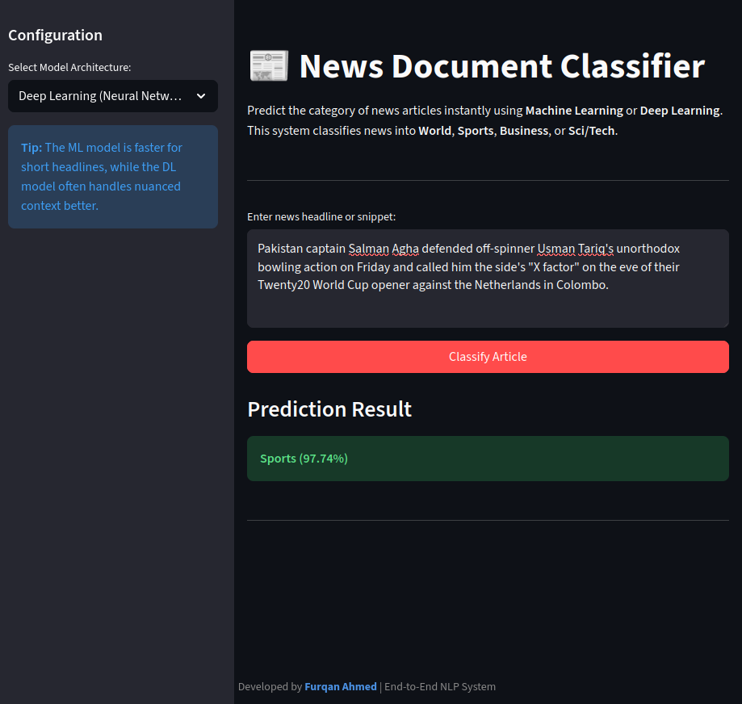

# 📰 News Document Classification System

An end-to-end **Natural Language Processing (NLP)** system that classifies news articles into  
**World, Sports, Business, and Sci/Tech** categories using both **traditional machine learning**
and **deep learning** models, wrapped in a production-ready inference layer and interactive UI.

---

## 🚀 Project Overview

This project demonstrates a complete machine learning lifecycle for text classification, covering:

- Exploratory data analysis and text preprocessing
- Feature engineering using TF-IDF
- Training and evaluation of classical ML models
- Deep learning with neural networks
- Model comparison and selection
- Production-grade inference logic
- Interactive Streamlit web application

The focus of this project is not just model accuracy, but **clean system design, reproducibility,
and deployability**, similar to real-world ML engineering workflows.

---

## 🏗️ System Architecture

Raw News Data
↓
Text Cleaning & Preprocessing
↓
Feature Extraction
├── TF-IDF → ML Models
└── Tokenization → Neural Network
↓
Trained Models (Saved Artifacts)
↓
Inference Layer
↓
Streamlit Web Application

---

## 🧠 Models Used & Design Decisions

### Traditional Machine Learning Models
- **TF-IDF + Logistic Regression**
- **TF-IDF + Support Vector Machine (SVM)**

These models serve as strong baselines for text classification tasks.  
They are fast, interpretable, and perform exceptionally well on structured news data.

### Deep Learning Model
- **Neural Network with word embeddings**

The neural network was trained to capture non-linear patterns and contextual information
beyond bag-of-words representations.

### Model Selection Rationale
Although ensemble approaches were explored, a single SVM-based model was preferred for
deployment due to its strong performance, lower inference latency, and reduced system
complexity. This aligns with real-world engineering trade-offs where simplicity and
maintainability are critical.

---

## 📊 Model Evaluation

Models were evaluated using standard classification metrics:

- Accuracy
- Precision
- Recall
- F1-score

| Model | Accuracy |
|------|----------|
| Logistic Regression | 90.39% |
| SVM | 90.71% |
| Neural Network | 91.01% |

> Detailed experiments and evaluations can be found in the Jupyter notebooks.

---

## 🌐 Live Demo

🔗 **Live Application:** https://huggingface.co/spaces/Furqan09Ahmed/news-document-classifier

The application allows users to input a news headline or article snippet and instantly
predict its category using either a machine learning or deep learning model.

---

## 📸 Application Preview

### Input Interface


### Prediction Output



## ⚙️ Run Locally

Clone the repository and run the application locally:

```bash
git clone https://github.com/Furqan09Ahmed/news-classification-system.git
cd news-classification-system

python -m venv venv
source venv/bin/activate
pip install -r requirements.txt

streamlit run app/app.py
````

---

## 🛠️ Tech Stack

* **Programming Language:** Python
* **Machine Learning:** Scikit-learn
* **Deep Learning:** TensorFlow / Keras
* **NLP:** NLTK
* **Web App:** Streamlit
* **Data Processing:** Pandas, NumPy
* **Visualization:** Matplotlib, Seaborn

---

## 👤 Author

**Furqan Ahmed**

* 🌐 Portfolio: [https://FurqanAhmed.me](https://FurqanAhmed.me)
* 💻 GitHub: [https://github.com/Furqan09Ahmed](https://github.com/Furqan09Ahmed)
* 🔗 LinkedIn: [https://www.linkedin.com/in/Furqan09Ahmed](https://www.linkedin.com/in/Furqan09Ahmed)

---
